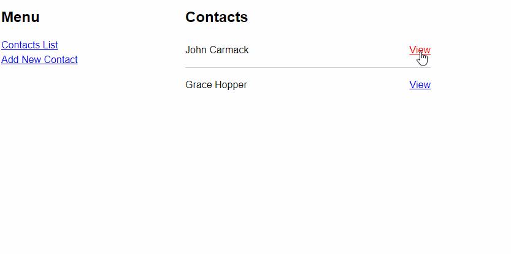

# React - Address Book Part 1

## Introduction

This exercise is entirely focused on planning the development of an application. With the exception of the optional prototype instruction, this repository should not contain any application source code.

## Instructions

Using the list of requirements in the section below, create plans or diagrams that include:

- A state model **(Required)**
    - This could be a plain text description of an object with specific properties, a sample JSON object, a class diagram
- User interactions **(Required)**
    - This could be a flow diagram or a simple bullet point list that details how a user interacts with the application
- A component tree **(Required)**
    - This should be a simple diagram that details which React components you are going to create and where they exist in the hierarchy. Include any state that each component will be responsible for in this diagram.
- A style guide **(Optional - Extension)**
    - A simple document that lists common CSS values to be used, such as text colours & fonts, button colours etc.
- A prototype app **(Optional - Extension)**
    - A very simple app that demonstrates the desired functionality. This could be entirely done in the `App` component with hard-coded state values and no styling

## Requirements

[You must use this API for your state](https://jsonplaceholder.typicode.com/). Scroll down to the section titled "Resources" to view the available endpoints.

1. A user can view a dashboard that displays a list of contacts
    - Each contact in the list should be displayed as their first and last names
2. A user can click a contact's name to view more details about that contact
    - The view should contain the contact's first and last name, as well as the contact's street and city
3. A user can create a contact via a form, accessed by clicking a "Create a contact" menu link
    - The form should create a contact with a first and last name, as well as a street and city
    - When submitted, the contact data should be sent to an API that saves it

## Notes

- The example below demonstrates the type of functionality required
- Your app does not need to look exactly like the example below as long as it satisfies the requirements

## Example application

